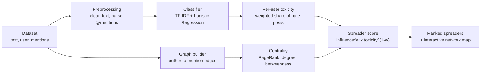

# Online Hate Speech Network Analyser

**Classify online messages as `Normal` / `Offensive` / `Hate` — then analyse the social network to reveal *who spreads the hate*, in one connected pipeline.**


> **Project novelty.** Existing tools typically do *either* hate-speech
> classification *or* social-network analysis. This project **chains them
> together**: the classifier's output feeds a network layer, so you move from
> *"is this message hateful?"* to *"which accounts are driving the hate, and how
> far does their reach extend?"* — all in a single, reproducible workflow.

---

## Run it yourself — 4 commands

Copy and paste these into a terminal (PowerShell, Command Prompt, or Terminal). Nothing else to download, and the sample dataset is already included.

```bash
git clone https://github.com/sampath-patil/online-hate-speech-network-analyzer.git
cd online-hate-speech-network-analyzer
pip install -r requirements.txt
streamlit run app.py
```

The app opens automatically at **http://localhost:8501**.

<details>
<summary><b>No git installed?</b> Click to expand</summary>

Click the green **Code** button at the top of this page, choose **Download ZIP**,
extract it, then open a terminal inside the extracted folder and run just the
last two commands:

```bash
pip install -r requirements.txt
streamlit run app.py
```
</details>

<details>
<summary><b>Prefer an isolated virtual environment?</b> (recommended) Click to expand</summary>

```bash
# create it
python -m venv venv

# activate it — Windows PowerShell
venv\Scripts\activate
# activate it — macOS / Linux
source venv/bin/activate

# then install and run
pip install -r requirements.txt
streamlit run app.py
```
</details>

### What to click once it's running

The app is a five-tab pipeline. Work left to right:

1. **Data** tab — click **Load sample dataset**. (Or upload your own CSV; only a text column is required.)
2. **Train & Evaluate** tab — click **Train model**. You'll get accuracy, macro-F1, a confusion matrix, and the top indicative words per class.
3. **Classify** tab — type any sentence and click **Classify** to see the prediction and confidence.
4. **Network & Spreaders** tab — click **Build network & rank spreaders** to get the interactive graph and the ranked list of spreaders.

There's also a **Dark mode** toggle in the sidebar. Everything runs locally — no data leaves your machine, and no API keys are needed.

---

## How it works

The two analysis branches run from the same dataset and converge on a single score — that convergence is the contribution of this project.



| Stage | What happens | Tech |
|-------|--------------|------|
| **1. Classify** | Every post is labelled Normal / Offensive / Hate with a confidence score, plus full evaluation metrics. | TF-IDF + Logistic Regression (scikit-learn) |
| **2. Connect** | Posts become a **directed graph**: an edge runs from an author to each account they mention, weighted by how toxic the post was. | NetworkX |
| **3. Rank spreaders** | Each user gets a **spreader score = network influence × content toxicity**, exposing accounts that are both toxic *and* central. | PageRank / betweenness / degree centrality |

---

## Screenshots

<!-- Replace these with your own screenshots.
     Upload images into the docs/ folder, then update the filenames below. -->

| The pipeline overview | Spreader network |
|---|---|
|  |  |

| Training metrics | Live classification |
|---|---|
|  |  |

---

## Project structure

```
online-hate-speech-network-analyzer/
├── app.py                          # Streamlit UI (5 tabs) — thin presentation layer
├── requirements.txt
├── README.md
├── LICENSE
├── .gitignore
├── .streamlit/
│   └── config.toml                 # default light theme
├── data/
│   └── sample_hate_speech.csv      # synthetic, network-rich sample dataset (300 rows)
├── models/                         # trained .joblib files land here (gitignored)
└── src/
    ├── preprocessing.py            # regex text cleaning + @mention extraction
    ├── classifier.py               # HateSpeechClassifier: train / predict / save / load
    ├── network.py                  # graph building, centrality, spreader ranking, Plotly viz
    └── data_utils.py               # schema, loading/validation, sample-data generator
```

The UI never contains analysis logic — it only calls into `src/`. That means the
interface can be restyled or rebuilt freely without touching the models or the
network mathematics.

---

## Using your own dataset

Upload any CSV in the **Data** tab. The only required field is a **text**
column; everything else is optional and mapped through dropdowns.

| Canonical field | Meaning | Required? |
|-----------------|---------|-----------|
| `text` | the post / tweet / comment | **yes** |
| `label` | `hate` / `offensive` / `normal` (many spellings, and the Davidson `0/1/2` scheme, are auto-recognised) | for training |
| `user` | author handle, becomes a network **node** | for network |
| `mentions` | comma-separated handles, become network **edges** (if absent, `@handles` are parsed from the text) | optional |

Public corpora that plug straight in: **Davidson et al. (2017)**, **HASOC**,
**HatEval**, **OLID / OffensEval**.

---

## How the spreader score works

A hate-speech **spreader** must be *both* toxic *and* influential:

```
influence = 0.5·PageRank + 0.3·degree + 0.2·betweenness   (each min-max normalised, 0..1)
toxicity  = ( 1.0·#hate + 0.5·#offensive ) / #posts        (0..1)
score     = influence^w · toxicity^(1−w)                    (weighted geometric mean, rescaled 0..100)
```

`w` is the **Reach ↔ Content** slider, trading network reach against content
toxicity; `w = 0.5` is balanced. The design handles both failure modes correctly:

- A viral but clean news account has `toxicity ≈ 0`, so it scores ≈ 0 — correctly *not* flagged as a spreader.
- A nasty account nobody listens to has `influence ≈ 0`, so it also scores ≈ 0.
- Only accounts that are **toxic AND central** rise to the top.

Because it's a geometric mean, a near-zero on either axis collapses the whole
score — which is exactly the behaviour you want from a spreader metric, and makes
it straightforward to defend.

---

## Roadmap

The code marks natural extension points with `# EXTEND:` comments.

- **Stronger models** — swap the TF-IDF pipeline for a fine-tuned transformer (`bert-base`, `HateBERT`, `distil-roBERTa`); `classifier.py` already isolates the model behind one class.
- **Live ingestion** — replace the CSV loader with a Reddit, Mastodon or X API pull to analyse real conversations.
- **Temporal spread** — the dataset carries `timestamp`; animate how hate propagates through the network over time.
- **Community detection** — run Louvain / Leiden to find the *clusters* amplifying a spreader, not just individual accounts.
- **Explainability** — add SHAP or LIME to justify each classification.
- **Cascade modelling** — model diffusion (Independent Cascade / Linear Threshold) to *predict* how far a piece of hate will reach.

---

## Notes on the sample data and ethics

The bundled sample dataset is **synthetic**. Its "hate" examples deliberately
target **fictional groups** (*greenskins*, *moon-dwellers*, and similar) so the
file stays appropriate to ship while still giving the classifier the linguistic
*pattern* of group-directed hostility. The "offensive" class does contain real
profanity, because an offensive-language classifier has to learn that
vocabulary. Metrics on this small set are illustrative — use a real annotated
corpus for meaningful accuracy figures.

This tool is intended for **research, moderation support, and academic study**.
Automated hate-speech systems can carry bias, for example over-flagging
particular dialects. Treat outputs as decision support, keep a human in the
loop, and validate on representative data before drawing conclusions about real
people.

---

## License

Released under the MIT License — see [LICENSE](LICENSE).
